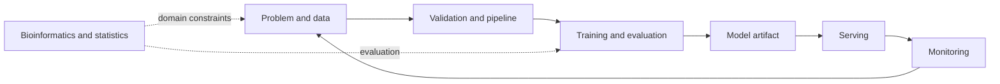

# ML Engineering Notes

기존의 데이터 분석 노트를 ML 시스템 생명주기에 맞춰 다시 연결한 입구입니다.
바이오인포매틱스와 통계는 별도 관심사가 아니라 데이터와 평가를 이해하기 위한
도메인 기반으로 둡니다.

## 중심 경로

- [ML Engineering](ml-engineering/index.md) — 데이터에서 운영까지의 전체 생명주기
- [AI](ai/index.md) — 모델과 학습 방법
- [파이프라인](pipeline/index.md) — 재현 가능한 workflow
- [도구 · 환경](environment/index.md) — 컨테이너, Kubernetes, 작성 환경

## 도메인 기반

- [데이터 수집](data-collection/index.md) — scraping, API, metadata
- [생물정보](bioinformatics/index.md) — metagenomics, microbiome
- [통계](statistics/index.md) — 회귀, 다변량, 반복측정
- [수학](math/index.md) — 선형대수
- [논문](papers/index.md) — 읽고 검증한 연구 기록