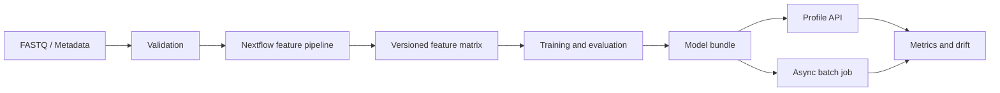

# MetaScale: Reproducible ML Platform

> [!warning] 구현 예정
> 현재 확인 가능한 산출물은 시스템 설계와 12주 완료 조건입니다. 코드, 성능, 처리량은 구현 후 측정값으로 교체합니다.

Shotgun metagenomics 데이터를 대상으로 데이터 검증부터 feature 생성, 학습,
서빙, 모니터링까지 연결하는 ML Engineering 프로젝트입니다.

## 프로젝트 포지션

> 대규모 원시 데이터를 병렬 처리하고, 고차원 feature에 대한 누수 없는 학습·평가
> pipeline을 구축하며, 데이터·모델 버전 관리부터 비동기 추론과 모니터링까지
> 연결하는 ML Engineer.

| 축 | 완료 기준 |
| --- | --- |
| Scale | sample 병렬 처리, dense/sparse 비교, runtime·memory benchmark |
| Reliability | schema validation, cohort split, reproducible artifact, contract test |
| Production Readiness | online/batch inference, metrics, drift simulation, CI release |

## 문제 선택

현재 경험은 bioinformatics workflow와 모델 실험 양쪽에 나뉘어 있습니다.
MetaScale은 두 경험 사이의 경계를 직접 구현하기 위한 프로젝트입니다.

- FASTQ와 metadata처럼 크기와 형식이 다른 입력 검증
- reference DB와 pipeline 버전에 따라 달라지는 feature schema 관리
- subject·cohort 누수를 막는 학습과 평가
- 학습한 preprocessing과 model을 같은 bundle로 서빙
- pipeline 실패, API latency, 입력 drift 관측

## 목표 아키텍처

## 평가 원칙

- row-level random split만으로 성능을 보고하지 않습니다.
- 동일 subject가 train과 test에 함께 들어가지 않도록 합니다.
- preprocessing과 feature selection은 train fold 안에서만 학습합니다.
- 평균 AUROC와 함께 AUPRC, calibration, worst-cohort 결과를 기록합니다.
- metadata-only baseline으로 cohort·수집 환경의 영향을 확인합니다.

## 12주 완료 기준

| 단계 | 주차 | 확인할 산출물 |
| --- | --- | --- |
| 데이터 계약 | 1~2 | manifest schema, validator, 작은 test dataset |
| Feature pipeline | 3~4 | Nextflow smoke run, versioned Parquet matrix |
| 학습·평가 | 5~7 | grouped CV, cohort hold-out, model card |
| Artifact·서빙 | 8~10 | MLflow record, model bundle, prediction/job API |
| 운영·배포 | 11~12 | metrics, drift simulation, CI, reproducible release |

## 증거 현황

| 항목 | 상태 |
| --- | --- |
| 문제·시스템 설계 | 작성됨 |
| 데이터 계약 | 예정 |
| 실행 가능한 smoke pipeline | 예정 |
| 모델 평가 결과 | 예정 |
| API demo | 예정 |
| latency·memory benchmark | 예정 |
| monitoring dashboard | 예정 |

## 범위에서 제외하는 것

- 임상 진단 성능 주장
- 실시간 FASTQ streaming
- 자체 reference database 구축
- 자동 production 승격
- 모델 수를 늘리기 위한 복잡한 딥러닝 실험

복잡한 플랫폼을 한 번에 만드는 대신, 각 단계가 작은 데이터에서 end-to-end로
동작하는지를 먼저 확인합니다.

## Domain

입력 데이터와 reference DB, profiling tool에 대한 상세 기록은
[Domain / Bioinformatics](../domain/bioinformatics/index.md)에서 분리해 관리합니다.
